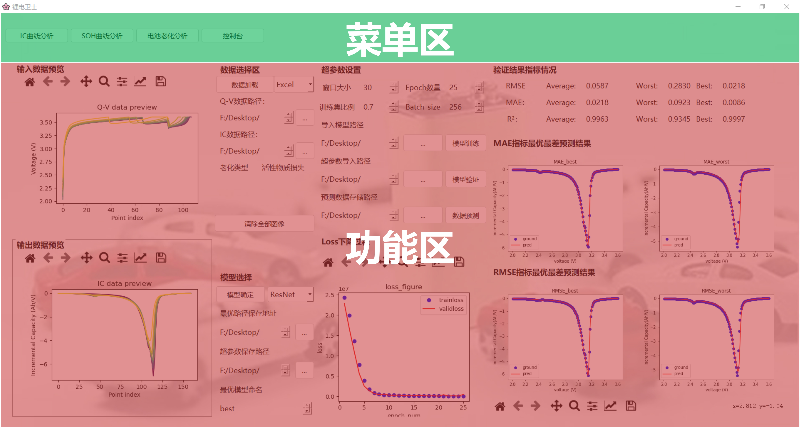
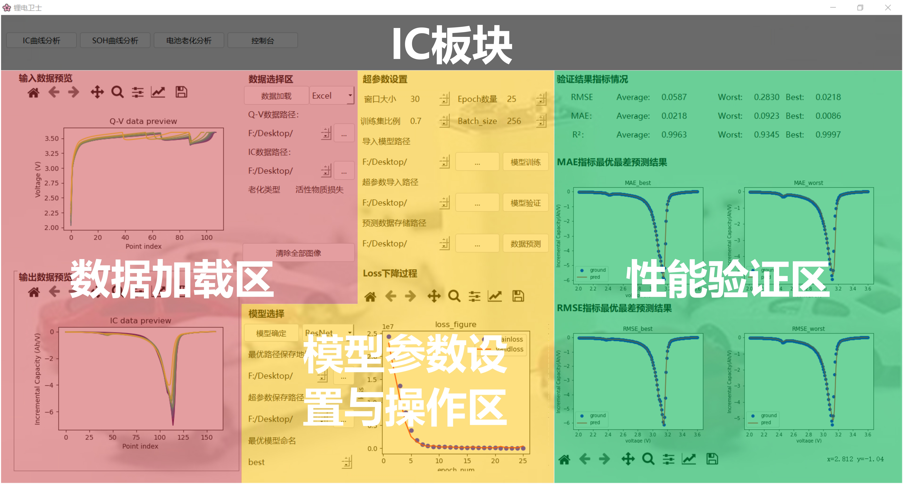
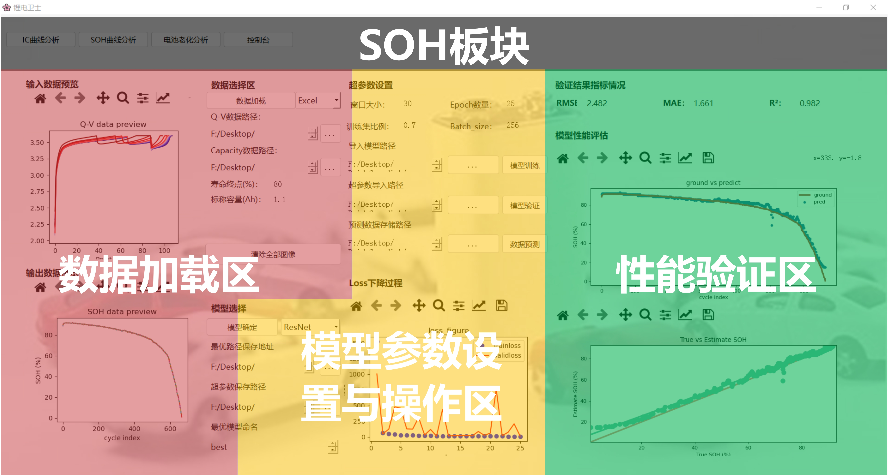
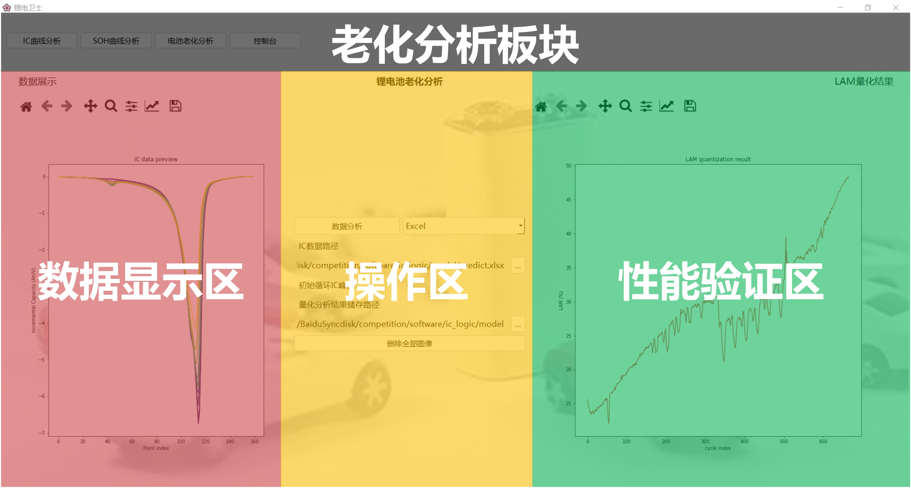

# 作品说明
**main：** 运行这个文件，这是软件的主入口
## 作品总览

## 文件目录
<pre>
Licon
├───component            # 页面组件
│   ├───ic
│   ├───old
│   └───soh
├───data                 # 需要分析的数据示例文件
│   ├───6C-60per_3C
│   │   ├───CH29
│   │   └───CH30
│   └───7C-40per_3C
│       ├───CH37
│       └───CH38
├───src                  # 资源文件
└───ui_source            # 原始ui文件
</pre>

## 界面介绍
### 总览
软件启动后直接进入的页面为IC版块，上方为模块选择和控制台按钮。

### IC板块

### SOH板块

### 老化分析

